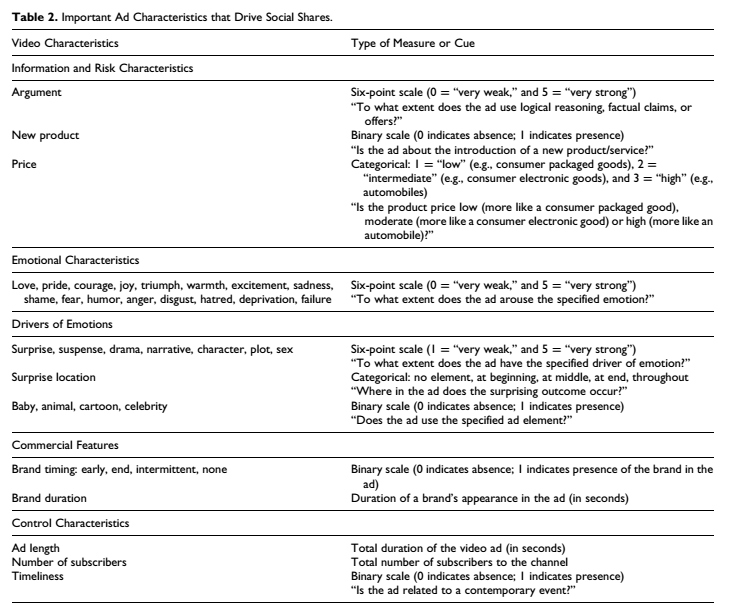
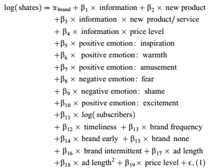
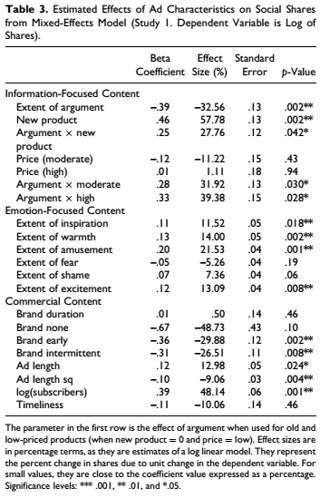
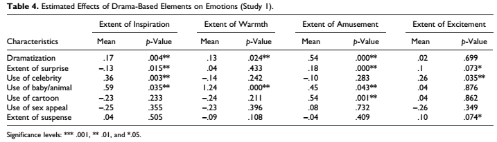
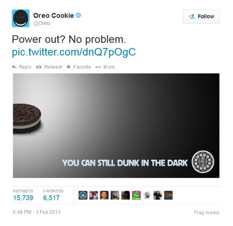
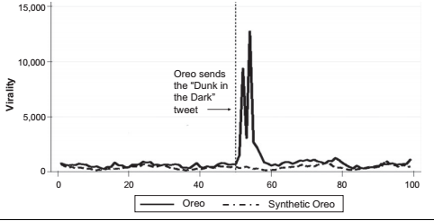
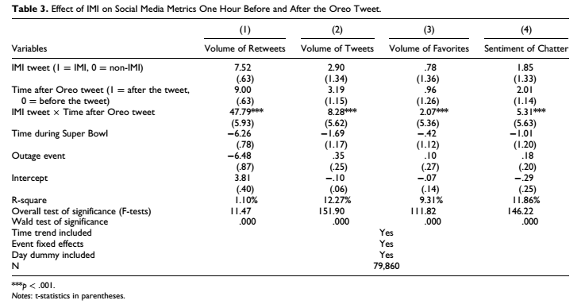

class: font200

# Learning Goals for this Week

* Define the term "Viral Marketing"
* Explain why Viral Marketing is important for firms
* Assess what aspects of an ad increase its virality
* Define Improvised Marketing Interventions (IMI)
* Assess effectiveness of IMI
* Critically evaluate marketing implications of research results

---
class: inverse, center, middle

# What is Viral Marketing?

---
class: font160
# Viral Marketing

**Virality**: achieving a large number of views in a short time period due to consumers sharing content online. 


Why do we care about virality?

* Ability to reach vast audiences in a short period of time at low cost
* Increases brand visibility and recognition $\rightarrow$ brand equity 
* (Increase in sales?)

---
class: font160
# Today's Agenda 

Two papers:

* [What Drives Virality (Sharing) of Online Digital Content? The Critical Role of Information, Emotion, and Brand Prominence][tellis]
  * Tellis, MacInnis, Tirunallai and Zhang (2019,  Journal of Marketing)
* [Improvised Marketing Interventions in Social Media][borah]
  * Borah, Banerjee, Lin, Jain and Eisingerich (2020, Journal of Marketing)

[tellis]: https://journals.sagepub.com/doi/10.1177/0022242919841034
[borah]: https://journals.sagepub.com/doi/full/10.1177/0022242919899383

---
class: inverse, center, middle

# What Drives Virality?

---
class: font160
# What Drives Online Sharing?

**Motivation**: What characteristics of an ad enhance its shareability? 

**Specific Questions**:

* Does information focussed content limit sharing?
* Does brand prominence decrease sharing?
* Do positive emotions increase sharing?

**How?**: Online video ads on YouTube

* Note: Paper is descriptive / predictive rather than causal

---
class: font160
# YouTube Advertising Data

All video ads between Nov 25, 2013 and March 4, 2014

* Approx 1,962 video ads

Info they get via Youtube's API:

* Shares on Facebook, Twitter, Google +, LinkedIn over first 30 days

Info about Ads: sample of 360 of ads collected, covers 79 brands

* Got coders (i.e. paid some people) to watch ads and write down whats in it


---
# Ad Characteristics

```{r, echo = FALSE, fig.align = "center", out.width="80%"}

```


---
class: font140
# Regression Equation

```{r, echo = FALSE, fig.align = "center", out.width="55%"}

```


Note: Think of this as a **descriptive** regression 

* They'll also use it for prediction on an (unseen) sample
* "Are these features predictive of shares?"  
  * My Q: If they really want to predict though, why not go machine learning route?

---
# Estimation Results

```{r, echo = FALSE, fig.align = "center", out.width="45%"}

```


---
class: font140
# Main Findings in Regression

* Information decreases shares
  * But not for a new products
  * And less for high price products

* Positive emotions lead to more shares
  * High arousal emotions not more effective than low arousal

* Timing of brand appearence and length of ad matters

**A critical eye**: They are cutting the data many ways for only 346 observations!

(Paper also discusses predictive power of model)

---
# Dramatic Elements and Emotions

```{r, echo = FALSE, fig.align = "center", out.width="100%"}

```


---
class: font160
# Marketing Implications

Drivers of sharing important to understand to help ads get shared

* This sounds *a little too causal*
* ... as will a lot of their implications

The authors want us to believe:

* Less information
* More positive emotions 
* More careful brand placement

are important to promote online sharing


---
class: inverse, center, middle

# Improvised Marketing Interventions

---
class: font160
# Improvised Marketing Interventions

**Improvised Marketing Interventions (IMI)**: composition and execution of a real-time marketing communication
proximal to an external event

**Motivation**: Are IMI's effective at generating online sharing?

**Specific Questions**:

* Do IMI's result in greater virality?
* What type of IMI yields greater virality?
* Do IMIs enhance firm value?

**How?**: A mix of experiment, quasi-experiment and observational data

* We'll look at a subset of their results, focusing on the first two questions


---
# IMIs and Virality

**Context**: Superbowl blackout, 2013

```{r, echo = FALSE, fig.align = "center", out.width="65%"}

```

---
# Virality of Oreo Tweet

```{r, echo = FALSE, fig.align = "center", out.width="100%"}

```

---
# Virality of Oreo Tweet

```{r, echo = FALSE, fig.align = "center", out.width="100%"}

```

---
# Timeliness & Unanticipation

**Study 2**: mTurk Survey

```{r, echo = FALSE, fig.align = "center", out.width="30%", fig.show = 'hold', fig.ncol = 2}
knitr::include_graphics(c("figs/borah_timeliness.png", "figs/borah_anticipation.png"))
```


---
class: font160
# Marketing Implications

* IMI can help business connect with an audience weary of traditional advertising messages

* Humor and Timeliness important

* Keeping a close eye on trends and online chatter 
  * ... and being able to formulate a witty post/response

* Warning: Need to be careful that don't offend
  * Example: [Burger King on International Women's Day](https://globalnews.ca/news/7683800/burger-king-womens-day-kitchen-tweet/)

---
class: inverse, center, middle

# Recap

---
class: font160
# Recap

* Viral Marketing is the rapid sharing of an ad online by consumers
* Ads are more likely to go viral if they:
  * Feature positive emotions
  * Are less informative
    * There are exceptions here - new prodcust, expensive products
  * Careful placement of brand name
* Improvised Marketing Interventions are heavily shared when they are timely and involve humor and aren't anticipated

---
# License & Citation

Suggested Citation:

```{r, engine='out', eval = FALSE}
@misc{smwa_lecture_06,
      title={"Social Media and Web Analytics: Lecture 6 - Viral Marketing"},
      author={Lachlan Deer},
      year={2021},
      url = "https://github.com/tisem-digital-marketing/smwa-lecture-06"
}
```

<p style="text-align:center;"></p>

This course adheres to the principles of the Open Science Community of Tilburg University. 
This initiative advocates for transparency and accessibility in research and teaching to all levels of society and thus creating more accountability and impact.

<p style="text-align:center;"></p>
This work is licensed under a <a rel="license" href="http://creativecommons.org/licenses/by-sa/4.0/">Creative Commons Attribution-ShareAlike 4.0 International License</a>.